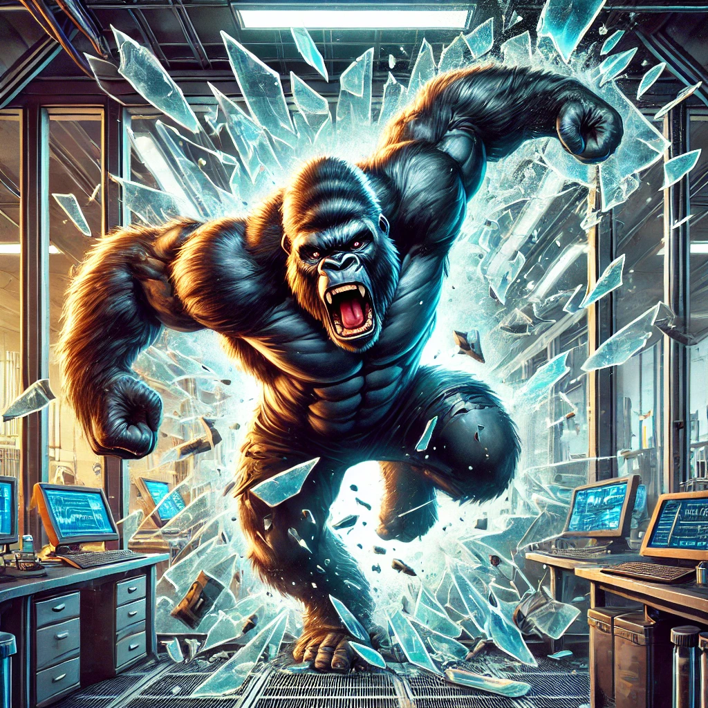

# Evasion

## Description
**Evasion** est un jeu d'évasion inspiré du jeu Ape Out. Vous incarnez un singe qui tente de s'échapper d'un laboratoire tout en affrontant des ennemis aux comportements différents.
Le **but** du jeu est d'atteindre les portes jaunes au travers des différents niveau pour permettre au singe de s'échapper.

## Fonctionnalités principales
- **Contrôle du personnage principal** : Déplacez le singe dans un environnement rempli d'obstacles et d'ennemis grâce aux flèches directionnelles.
- **Capturer et propulser des ennemis** : Utilisez vos adversaires à votre avantage pour créer des ouvertures avec la touche "c" du clavier pour capturer et "v" pour propulser.
- **Comportments des ennemis** : Les ennemis utilisent des comportements comme wander, flee, align, cohesion, separation, leaderFollow, avoid et pursue.
- **Système de niveaux** : Progressez à travers 3 niveaux avec des difficultés croissantes.
- **Menu interactif** : Inclut des sliders dans les paramètres pour configurer la vitesse, force, champs de vision et dégats des ennemis/ joueurs.

## Installation
### Étapes
1. Clonez ou téléchargez le dépôt.
   ```bash
   git clone https://github.com/GuiBenn/Evade.git
   ```
2. Installez Visual Studio HTTP Live Server extension
3. Lancez le fichier `index.html` dans votre navigateur en cliquant droit puis "Open with Live Server".

## Contrôles
### Clavier
- **Flèches directionnelles** : Déplacer le singe.
- **`C`** : Capturer un ennemi proche.
- **`V`** : Propulser un ennemi capturé.
- **`R`** : Retourner au menu principal.
- **`D`** : Activer/désactiver le mode debug.

---

## Organisation des fichiers
```
ape-out/
├── assets/
│   ├── images/        # Images pour le jeu (personnages, obstacles, etc.)
│   |── sounds/        # Effets sonores et musiques
|   |── fonts/         # Police d'écriture du jeu
├── scripts/
│   ├── behaviors/     # Scripts de comportements (Arrive, Flee, Avoid, etc.)
│   ├── characters/    # Scripts pour les entités (Player, EnemyBase, Leader, Boss)
│   ├── manager/       # Gestionnaires pour le jeu, le menu, et les niveaux
│   └── levels/        # Définition des niveaux
|── index.html         # Point d'entrée du jeu
|── sketch.js
```

## Fonctionnalités techniques

### Chargement des assets

### GameManager
Le `GameManager` met à jour et montre les **états** du jeu : `menu`, `settings`, `playing`, `gameOver`, `victory`.  

### LevelManager
Le `LevelManager` gère le **changement** et la **construction** des niveaux.

### BehaviorManager
- Chaque entité (joueur ou ennemi) possède un `behaviorManager`. 
  - On peut y **ajouter** des comportements (pursue, flee, avoid, wander, align, cohesion, separation, leaderFollow…).  
  - On peut **activer** ou **désactiver** un comportement selon la situation.  
  - Le manager calcule la somme des forces de chaque comportement actif et applique le résultat à l’entité.

### Joueur
- Peut **capturer** un ennemie à portée (`handleCapture()`).  
- Lorsqu'un joueur capture un ennemie, peut se servir de lui comme **bouclier humain**. i
- Peut **propulser** un ennemi capturé devant lui, dans la direction de sa vitesse (`handlePropulsion()`). 
- Il peut aussi les projeter contre les murs ou sur d'autres ennemis (qui provoque leur mort).
  NB : dans la méthode `handlePropulsion()`, je n'arrive pas a avoir un réel effet de propulsion en avant, c'est pourquoi je lache seulement l'ennemi devant le joueur.
- Dispose d’une **barre de vie** (de 0 à 100). Au-dessous de 0, le joueur meurt.  

### Ennemis (EnemyBase, EnemyLeader, Boss)
- **EnemyBase** :  
  - Par défaut statique (vel=0) quand il ne voit pas le joueur.  
  - Quand le joueur est en vision, il active `pursueBehavior`. S’il fait partie d’un groupe et que son leader est vivant, il suit le leader.  
  - Quand le leader de son groupe est mort, il passe en **flee** et ne tire plus.  
- **EnemyLeader** :  
  - Déplacement **wander** quand il ne voit pas le joueur.  
  - Poursuit et tire sur le joueur quand il le détecte.  
  - Peut recruter des `EnemyBase` proches pour former un groupe.  
  - Attention, lorsqu'il tire, ses balles peuvent rebondir (2 fois).
- **Boss** :  
  - Statique tant qu’il n’a pas repéré le joueur.  
  - Poursuit le joueur mais ne tire pas de projectiles.  
  - Généralement plus rapide, si il touche le joueur, le joueur meurt.

### Menus et interface
- **Menu principal** : un simple bouton « Lancer la partie », « Paramètres ».   
- **Paramètres** : présence de *sliders* (vitesse du joueur, vitesse ennemis, forces maximales, etc.).
- **MenuManager** : animation du titre « Evasion » via des vehicules (arrive, flee…), et un singe qui traverse l’écran de gauche à droite.

### Paramètres
- Plusieurs sliders gèrent :  
  - **Vitesse** (EnemyBase, EnemyLeader, Boss, joueur).  
  - **Force max** (EnemyBase, EnemyLeader, Boss, joueur).  
  - **Taille de vision** (ex. `sliderEnemyVision`) pour ajuster l’angle ou distance de détection.  
  - **Dégâts** infligés par les ennemis (`sliderEnemyDamage`).  
  
---

## Auteurs
Ce projet a été développé par **Benezech-Loustalot Guillaume** dans le cadre d'un mini-projet p5.js en "IA Réactives" pour la MIAGE IA2.

---
Merci d'avoir joué à **Evasion** !
